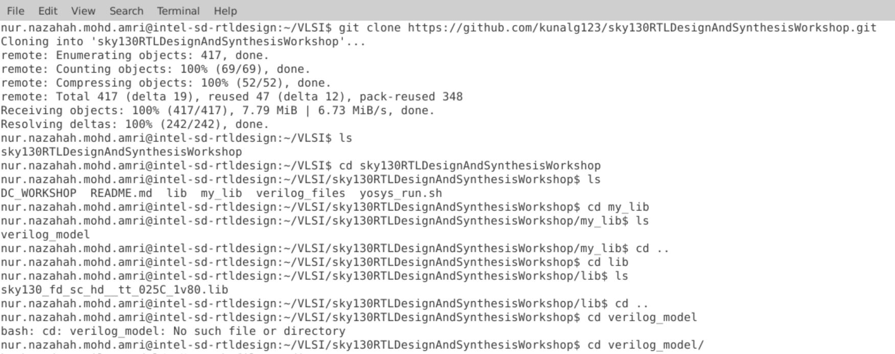
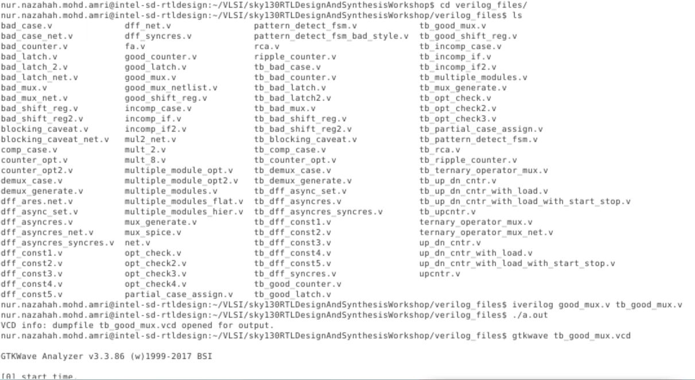
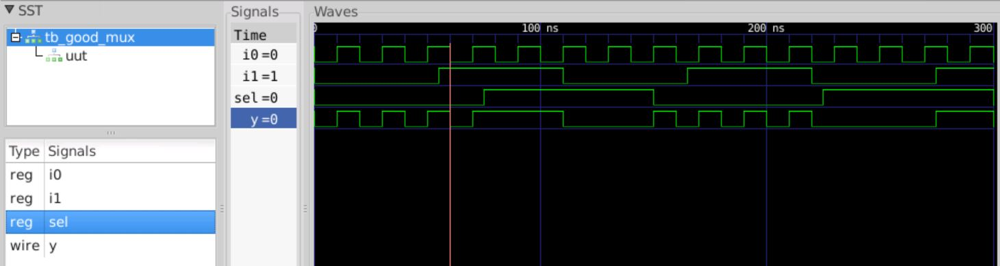
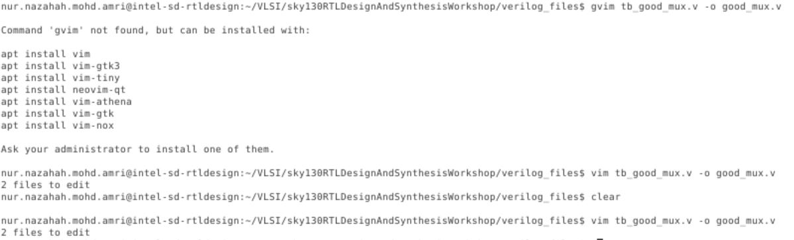
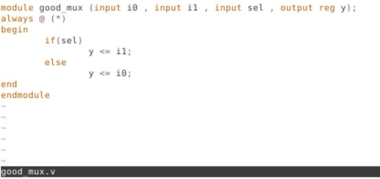
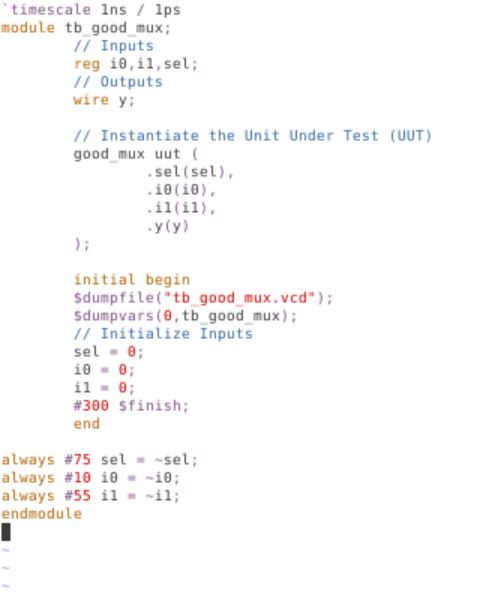

# Intel SD Training

## Table of contents

* [ Day 0 - System/Tool Setup Check. GitHub ID creation ](https://github.com/nurnazahah/sd-training/blob/main/readme.md#day-0)
* [ Day 1 - Introduction to Verilog RTL design and Synthesis ](https://github.com/nurnazahah/sd-training/blob/main/readme.md#day-1)

## Day-0

### Topic: System/Tool Setup Check. GitHub ID creation

**What is package?**

It is the material that contains semiconductor device attached with a die using wire bonding. The chip is also correlated with the pads, core, macros and foundry IPs.

**Example of the package structure**

**Pad**: surface mount of pins connected

**Core**: all NMOS and PMOS are in the core area

**Macros**: protocol to transfer data using simple codes and can be found online

**Foundry IPs**: has specific functionality and cannot be found online

###############################################################################################

**Communication of Software and Hardware**

Undergo synthesis process which convert software’s instructions in HLL to machine language in binary format

Software (HLL) -> System software (assembly language) -> Hardware (machine language)

###############################################################################################

#### Lab Result

This is my first repository

## Day-1 

### Topic: Introduction to Verilog RTL design and Synthesis

#### Lab Result

##### Lab introduction

##### Lab part 1

Scripting

Output

##### Lab part 2 

Scripting to open GVIM

RTL code for design

RTL code for test bench

